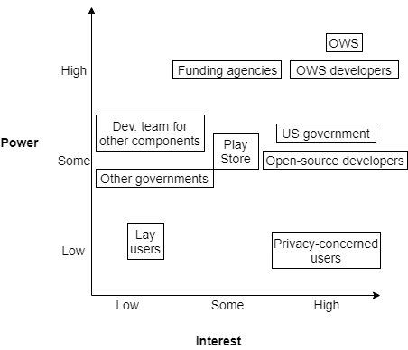

# Stakeholders

This document describes the stakeholders of Signal Android.

## Power--Interest Matrix

The following figure presents an overview of the main groups of stakeholders of Signal Android.

## List of Stakeholders

* **Open Whisper Systems/Signal Messenger/Signal Foundation:** Open Whisper Systems (OWS) is the original organization that created and developed Signal. While the internal structure is not known, OWS, led by its founder Moxie Marlinspike, is responsible for promoting Signal [1]. Because Signal is the flagship software system of OWS [2], the credibility and viability of this organization largely depends on the success of Signal. In 2018, a new organization, Signal Messenger, was created to take over the development of Signal. This organization is a subsidiary of the new, non-profit organization Signal Foundation [3].
* **Core developers:** SF hires a team of developers that ensure the development and maintenance of Signal. The role of each developer is unknown, but the small size of the team (less than 7 people as of February 2018 [4]) and the description of the open positions [5] indicate that team members are involved in many aspects of the development and maintenance of the process.
* **Open-source developers:** Being an open-source project, an active open-source community backs Signal Android's development. The official GitHub repository lists 175 contributors as of January 2019 [6], and the development is supported by a forum [7] where users and contributors can request features or ask for help in developing new features or fixing bugs.
* **Development teams for other Signal components:** The development of other Signal components (Signal protocol [8], central servers [9], other clients[10]) influence each others: they must be designed to work efficiently and consistently with each other, and a major change to the interface of one component (e.g., the encryption/decryption protocol) will largely affect the other components.
* **Privacy-concerned users:** The main selling point of Signal is its privacy. The initial target audience is the privacy-concerned users looking for a secure way to communicate with each other [11], such as the renown security expert Edward Snowden [12]. This group of users must be able to satisfy their concerns about the security aspects of the application, and compare the privacy offered by this application against other alternatives.
* **Lay users:** Being a messaging application, Signal is used by a large public of users who are not knowledgeable about privacy, but wish to communicate with a secure application nonetheless. Such users can be initially motivated by privacy-concerned users [13], or by the recent attention on privacy growing in mainstream media due to recent incidents [14]. However, these users may more easily switch to an alternative messaging application, even one less secure, if the other features of Signal have usability issues.
* **Funding agencies:** The development of Signal is supported by funding agencies. Because the application does not generate any direct revenue (e.g., there is no paid version), the development and maintenance costs must be supported by grants, including from the US government [15], and individual donations through the Freedom of the Press Foundation [16] or other means [17]. SF must show that their product aligns with the funding agencies' objectives.
* **US Government:** Because SF is an American organization, it falls under the laws created by the US government. In particular, encrypted communications is a highly debated topic among politicians and citizens, centering about the question *"Should a governmental agency be able to read the private communications of two people to help in ongoing investigations?"* The laws derived from this debate will directly affect Signal, which relies a lot on cryptographic features. For example, the US Justice Department has already issued requests for information to OWS [18].
* **Other governments:** Other governments may also impose laws that will have a direct impact on the use of Signal for users in their jurisdiction. However, depending on the number of users under these governments and the government policies, the impact on Signal will vary. For example, EU's new GDPR [19] impacts a large number of users, but does not contradict the principles on which Signal is built. On the other hand, Australia's new Assistance and Access bill impacts a smaller proportion of Signal's users, but a core principle of its architecture [20]. Some countries also censored Signal, forcing users to find workarounds and OWS to deal with legal repercussions [21].
* **Play Store/APK download sites:** Repositories such as Google's Play Store or direct APK download sites (including from Signal's domain [22]), on which the Signal client is distributed, offer a way for users to get access to the client, as well as a way to receive useful information such as crash reports and user statistics [23]. However, these repositories implicitly endorse the application when accepting to distribute it. Therefore, they must ensure that the software complies with their terms of use. Otherwise, the repository would stop distributing the client, which would have a high impact on its user base.

## End Notes

[1] They maintain a blog at https://signal.org/blog/.

[2] https://en.wikipedia.org/wiki/Open_Whisper_Systems. The domain https://whispersystems.org/ redirects to Signal's domain, https://signal.org/.

[3] https://signalfoundation.org/

[4] https://signal.org/blog/signal-foundation/

[5] The "Android Developer" open position call, found at https://jobs.lever.co/signal/cc2a16be-b9aa-496e-ba2c-cf8ba3672267, indicates "We're a small organization; you will be involved in every aspect." The unstable URL can be reached from https://signal.org/workworkwork/, clicking on "View Role" under "Open Roles" and "Android Developer".

[6] https://github.com/signalapp/Signal-Android/graphs/contributors

[7] https://community.signalusers.org/ (see the special tag "Android Development" for questions related to the Android client in particular, https://community.signalusers.org/c/development/android-development)

[8] Signal Protocol Java library: https://github.com/signalapp/libsignal-protocol-java

[9] Signal servers: https://github.com/signalapp/Signal-Server

[10] Other clients include a desktop client built on top of Electron: https://github.com/signalapp/Signal-Desktop

[11] Signal appears in many blog's as a good option for a secure messaging app: e.g., https://www.techworld.com/security/best-secure-mobile-messaging-apps-3629914/, https://heimdalsecurity.com/blog/the-best-encrypted-messaging-apps/

[12] https://www.newsweek.com/bad-news-fbi-edward-snowdens-favorite-chat-app-signal-just-got-50m-funding-816035

[13] Signal relies a lot on word of mouth to gain new users, and actively incentivize existing users to encourage others to adopt Signal: https://support.signal.org/hc/en-us/articles/360007319831-How-can-I-contribute-to-Signal-

[14] https://www.nytimes.com/2016/12/07/technology/personaltech/worried-about-the-privacy-of-your-messages-download-signal.html

[15] https://www.cyberscoop.com/tor-signal-funding-donald-trump-steve-bannon-encryption/

[16] https://freedom.press/crowdfunding/signal/

[17] Signal Foundation founder Brian Acton invested 50M USD out of his pocket. https://www.wired.com/story/signal-foundation-whatsapp-brian-acton/

[18] https://www.nytimes.com/2016/10/05/technology/subpoenas-and-gag-orders-show-government-overreach-tech-companies-argue.html

[19] https://en.wikipedia.org/wiki/General_Data_Protection_Regulation

[20] https://signal.org/blog/setback-in-the-outback/

[21] https://signal.org/blog/looking-back-on-the-front/

[22] https://signal.org/android/apk/

[23] https://github.com/signalapp/Signal-Android/issues/127#issuecomment-13335689
