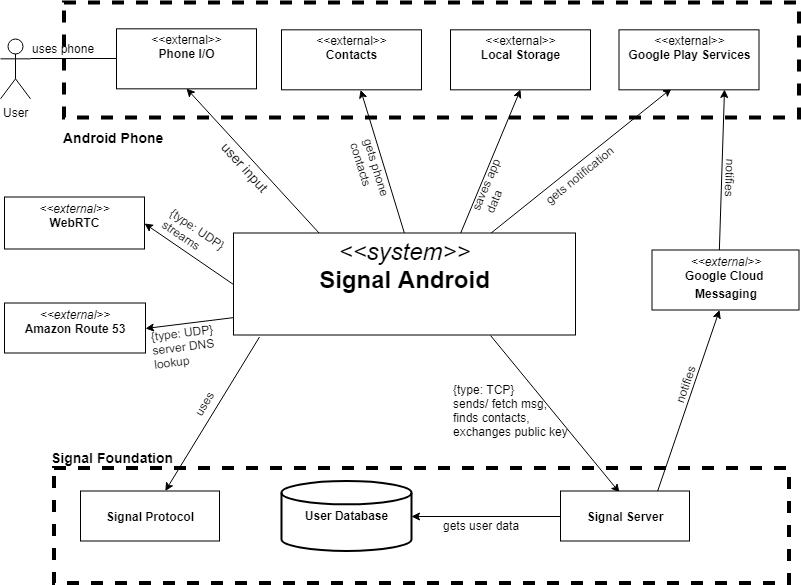

# Context View

This view describes how the system interacts with its environment.

## Functional Requirements and System Qualities

As a messenger application, Signal Android provides typical communication features:

- Messaging (one-to-one and group chats)
- Voice and video call (one-to-one)
- Phone contact import
- Encrypted communication channels between the client and Signal's servers

Furthermore, it focuses on these system qualities:

- Secure and private conversation
- High-available service
- High-quality and low-latency voice and video call
- Flexible

## Development Context

This first model presents the external entities relevant for the development of Signal Android. The labels of the edges are meant to be read from the inside out (e.g., "Signal Android is *used by* Users").

Signal Android is part of the Signal ecosystem, managed by the Signal Foundation. Together with other clients, it communicates with Signal Server, and uses  Signal protocol to encrypt communications. It's an open source project hosted on GitHub, and builds around the Android Framework. The application is available on Google Play. As a simple and private messenger product, it mainly targets lay and privacy-concerned users.

Each of these components are described in more details in the description of the [stakeholders](../1-introduction/stakeholders.md). We refer the reader to this file for more information about the influence of these external entities on Signal Android.

## Run-time Context

The following context model shows external entities with which Signal Android communicate at run-time to achieve its functional requirements and system qualities.

### Entity Table

| Entity                 | Related Repository or Documentation                          | Note                                                         |
| :--------------------- | :----------------------------------------------------------- | ------------------------------------------------------------ |
| Signal Android         | [Source Repository](https://github.com/signalapp/Signal-Android) | The system                                                   |
| Signal Protocol        | [Source Repository](https://github.com/signalapp/libsignal-protocol-java) | The encryption protocol used by Signal Android               |
| Signal Server          | [Source Repository](https://github.com/signalapp/Signal-Server), [Contact Discovery System](https://github.com/signalapp/ContactDiscoveryService) |                                                              |
| User Database          | [Server Database module](https://github.com/signalapp/Signal-Server/tree/master/src/main/java/org/whispersystems/textsecuregcm/storage) | Database for server to store account information             |
| Google Cloud Messaging | [GCM Documentation](https://developers.google.com/cloud-messaging/), [GCM configuration](https://github.com/signalapp/Signal-Android/blob/v4.32.8/AndroidManifest.xml#L475) | Signal Server sends push notification to Signal Android via GCM |
| WebRTC                 | [WebRTC Documentation](https://webrtc.org/), [WebRtcCallActivity](https://github.com/signalapp/Signal-Android/blob/master/src/org/thoughtcrime/securesms/WebRtcCallActivity.java), [WebRtcCallService](https://github.com/signalapp/Signal-Android/blob/master/src/org/thoughtcrime/securesms/service/WebRtcCallService.java), [webrtc/](https://github.com/signalapp/Signal-Android/tree/master/src/org/thoughtcrime/securesms/webrtc) | WebRTC is used for voice and video streaming                 |
| Amazon Route 53        | [Amazon Route 53 Documentation](https://aws.amazon.com/route53/), [Signal Blog Post](https://signal.org/blog/low-latency-switching/) | Used as a latency based DNS lookup server for Signal Server  |
| Local Storage          | [Android Local Storage via SQLite](https://developer.android.com/training/data-storage/sqlite) | Signal stores application data (e.g. history messages) in phone local storage |
| Contacts and Phone I/O | [Permissions](https://github.com/signalapp/Signal-Android/blob/master/AndroidManifest.xml#L22) | Signal requires permission to access the contacts list and several of the phone's I/O devices |
| Google Play Services   | [Play Services Documentation](https://developers.google.com/android/guides/setup) |                                                              |

## Typical Usage Scenarios

This section describes three scenarios, which show the interactions between the users, Signal Android, and external entities, to demonstrate how functional requirements (1-3) are achieved. The forth functional requirement will be explained in [Functional View](../3-functional/functional.md/#Key-Exchange) Key Exchange Section.

### Scenario 1: One-to-one conversation

**Assumptions:**

1.  User A and User B are in a Signal conversation.
2.  User A and User B both use Android [1] phones with Google Play Services [2].

**Details:**

1.  User A types a text message and presses “send”. (User ->Android Phone, Phone I/O)
2.  Signal Android gets the message from Android Phone, Phone I/O.
3.  Signal Android requests Amazon Route 53 for Signal Server DNS lookup.
4.  Amazon Route 53 returns a list of nearby Signal Server addresses.
5.  Signal Android establishes connection with the most suitable Signal Server (physically close and not overloaded).
6.  Signal Android encrypts message with Signal Protocol and sends it to Signal Server.
7.  Signal Server verifies the sender's identity.
8.  Signal Server caches the encrypted message in a message queue.
9.  Signal Server asks Google Cloud Messaging [3] to wake up the Signal Android for User B.
10. Google Cloud Messaging notifies Google Play Services in User B's Android phone.
11. User B's Google Play Services notifies User B's Signal Android about the incoming message.
12. User B's Signal Android gets the encrypted message from Signal Server's message queue, decrypts the message.
13. User B's Signal Android  uses Google Play Service to display the new message notification in the Android phone.

### Scenario 2: One-to-One Voice/Video call

**Assumptions:**

1.  User A and User B are in a Signal conversation.
2.  User A and User B both use Android phone with Google Play Services.

**Details:**

1.  User A clicks “start video/voice call” button.
2.  Signal Android gets the "start video/voice call" command from Android Phone, Phone I/O.
3.  Signal Android connects with the server (Scenario 1, steps 3 to 5).
4.  User A's Signal Android notifies the Signal Server that he wants to start a video/voice call with User B.
5. Signal Server uses Google Cloud Messaging to send push notification to User B's Signal Android to notify him about the incoming call.
6. Signal Server helps User A's Signal Android figure out User B's IP address.
7.  User A's Signal Android uses WebRTC to set up an encrypted video/voice streaming channel [4].

### Scenario 3: Phone Contact Discovery

**Assumptions:**

1. User wants to discover which of his phone contacts are using Signal.

**Details:**

1.  User clicks “Import contact from phone” button.
2.  Signal Android gets the "import contact" command from Android Phone, Phone I/O.
3.  Signal Android gets the contacts from Android Phone, Contacts.
4. Signal Android connects with Signal Server (Scenario 1, steps 3 to 5).  
5.  Signal Android encrypts the contact information and sends it to Signal Server.
5. Signal Server finds out the registered Signal users in  the User's contact book.
6. Signal Server returns the encrypted Signal user list to Signal Android.

## System Qualities

This section discusses how system qualities are achieved through the choice of the right external entities.

### Amazon Route 53

Amazon Route 53 is used as a DNS provider, with its "latency based routing" service, it is able to help client figure out which server is closest to them.

The client uses UDP [5] to request Amazon Route 53. UDP transmission is fast due to its simplicity. For DNS lookup, simple protocol like UDP is sufficient.

As the product of the world's largest cloud service provider, Amazon Route 53 is basically **highly available** and **scalable**.

Additionally, for open source non-profit project like Signal, Amazon Route 53 is an attractive option as it's cheaper than other providers (e.g. Signal's previous DNS provider Dynect)[6].

### Signal Server: Switch

Signal Server provides a switching service for clients.

As mobile data network usually employs NATs, switch is needed to set up a communication channel between two mobile clients. The switch will acts as a basic [TURN server](https://en.wikipedia.org/wiki/Traversal_Using_Relays_around_NAT), shoveling packets back and forth between connecting clients.

**High availability** is achieved by deploying redundant switches, **low-latency** is achieved by having switch physically close to the clients [6].

### Signal Server: Contact Discovery System

Signal Server's subsystem Contact Discovery System allows user to import phone contacts to Signal. It's able to figure out the common set of Signal users and user phone contacts.

The contact discovery process is designed with **privacy** in mind. Contact book is encrypted in client side before sending to the server. With the help of secure SGX enclave, the Contact Discovery System is able to find out which of the device's contacts are Signal users, without knowing the content of the encrypted contact book [7].

### Local Storage

For **data privacy**, the application data is encrypted by Signal Android before saving it to Android Phone/ Local Storage. Android has built-in local database [SQLite](https://www.sqlite.org/index.html) for application data storage. Signal adopted the SQLite extension [SQLCipher](https://www.zetetic.net/sqlcipher/) that provides additional encryption of database files.

### User Database

User database stores encrypted registered user phone number and profile data. For **privacy** reason, Signal only stores the minimal necessary user data and implements techniques like profile key to make sure only authorized users can access the data [8].

### Google Cloud Messaging

Google Cloud Messaging is used to achieve push notification from server to client.

Signal uses push-notification approach instead of keeping open sockets as push-notification will provides a **smoother** user experience to mobile users.

Additionally, as a product of one of the largest cloud service providers, Google Cloud Messaging is **scalable** and **highly available**.

## Evolution Insight
As a part of a larger ecosystem and a long life product in the market, Signal Android has to be relatively **flexible** so it can co-evolve with other systems. The notification system actually undergoes a series of iterations these years. Initially, as illustrated in the Run-time Context Diagram, it's based on Google Cloud Messaging. Later in 2017, to get rid of dependency on Google services, it provided a fallback WebSocket solution. This year, Google Cloud Messaging became deprecated, and would be shut down by Google by the end of 2019. Signal team began to migrate from Google Cloud Messaging to Google Firebase Messaging [9], the migration is finished in mid February this year [10].

The Websocket support will be explained in detail in [Evolution Perspective](../AD-development/evolution.md#Integration-of-WebSockets). As flexibility is a property of system internal architecture, it's explained together with the system internal structure introduced in functional view.

## End Notes

[1] While out of scope of the AD, Signal Android user can message Signal user on other platform, or non Signal user, in the latter case the message will be sent in the SMS format.

[2] In the past, Signal Android only supports Android phone with Google Play Services. From February 2017, it also [supports](https://github.com/signalapp/Signal-Android/commit/1669731329bcc32c84e33035a67a2fc22444c24b) Android without Google Play Service by providing a [WebSocket](https://en.wikipedia.org/wiki/WebSocket) based fallback solution. The fallback solution is excluded from the model for simplicity.

[3] Evidence: Google Cloud Messaging is used for push notification. https://signal.org/blog/signal-video-calls-beta/ and https://www.reddit.com/r/signal/comments/60plj2/are_push_notifications_a_risk/

[4] Evidence: WebRTC is used for streaming. https://signal.org/blog/signal-video-calls-beta/

[5] Client sends UDP request to Amazon Route 53. However, there is a packet size limit for UDP, TCP will be used as the fallback protocol for packet larger than 512 bytes. https://docs.aws.amazon.com/Route53/latest/DeveloperGuide/DNSBehavior.html

[6] Creating a low latency calling network: https://signal.org/blog/low-latency-switching/

[7] Private contact discovery: https://signal.org/blog/contact-discovery/ and https://signal.org/blog/private-contact-discovery/

[8] Encrypted profile: https://signal.org/blog/signal-profiles-beta/

[9] GCM is deprecated, Signal has switched to Firebase messaging.
https://github.com/signalapp/Signal-Android/blob/master/src/org/thoughtcrime/securesms/gcm/FcmService.java

[10] The migration to Firebase messaging is under development as of 15 February 2019. Because of its recency, it is not shown in the context diagram.
https://github.com/signalapp/Signal-Android/commit/a6564f8f8458fa256e4b68fef65210ee0c30d518
