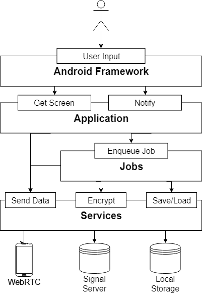
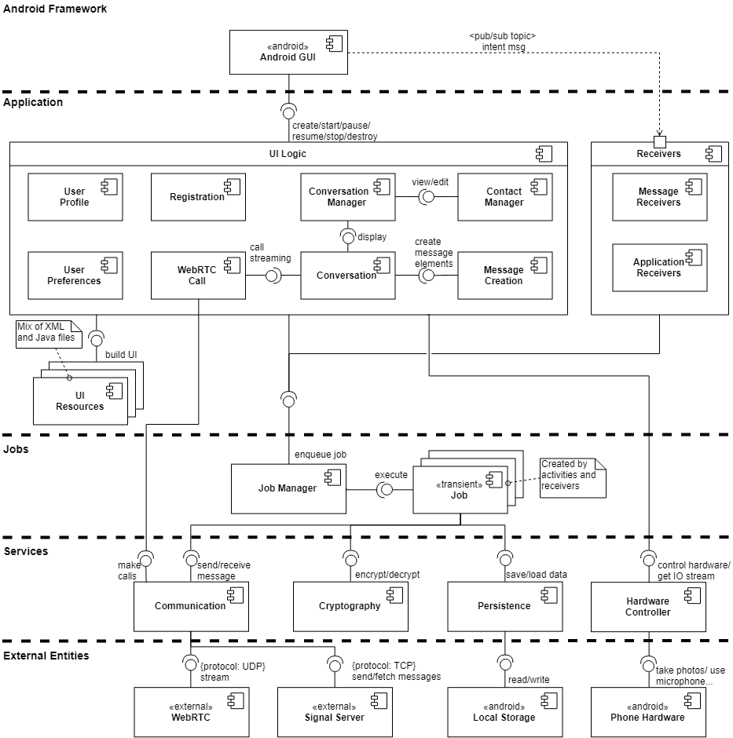
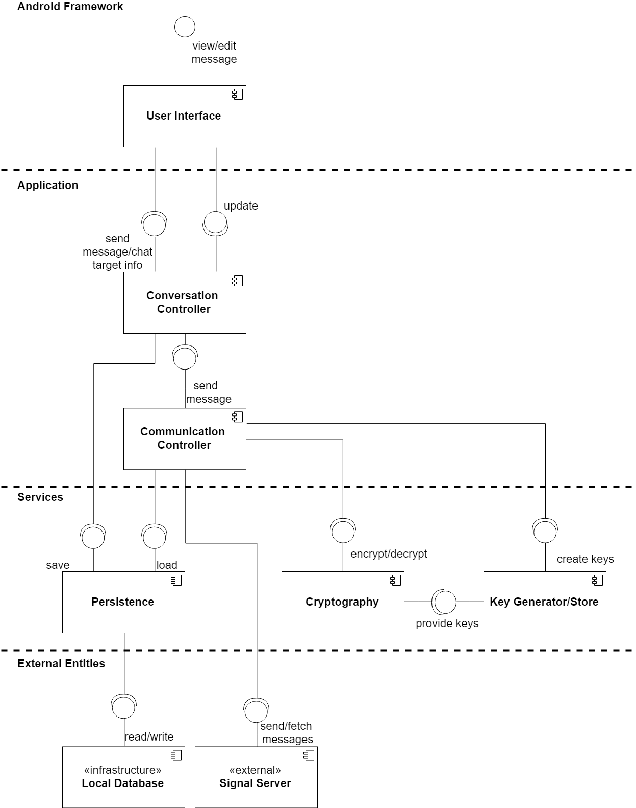
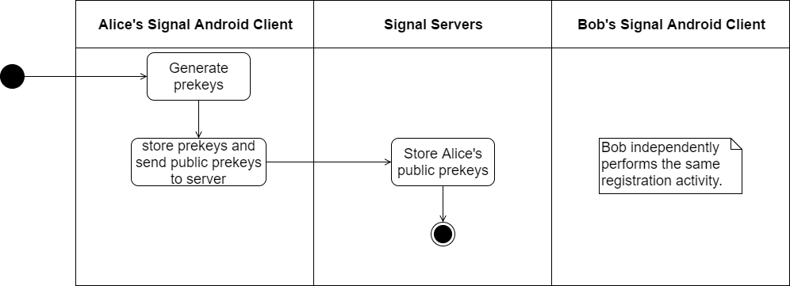
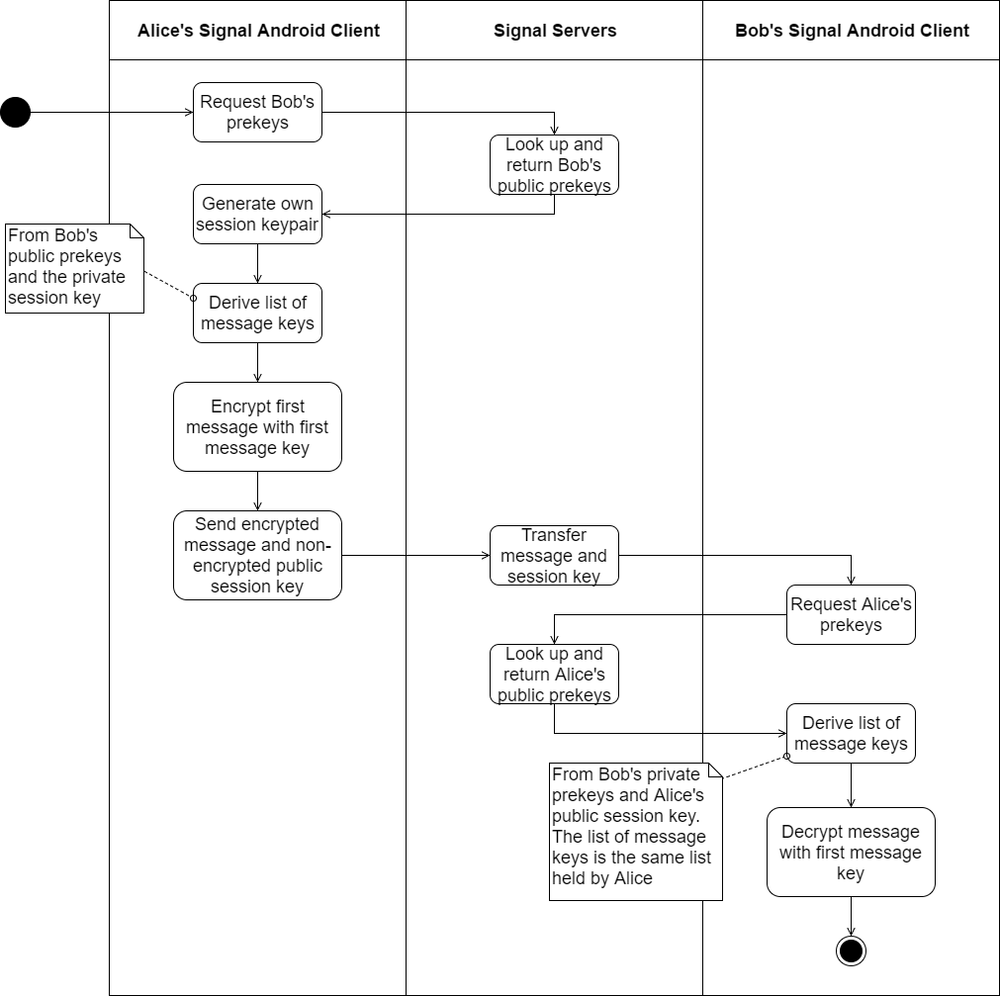
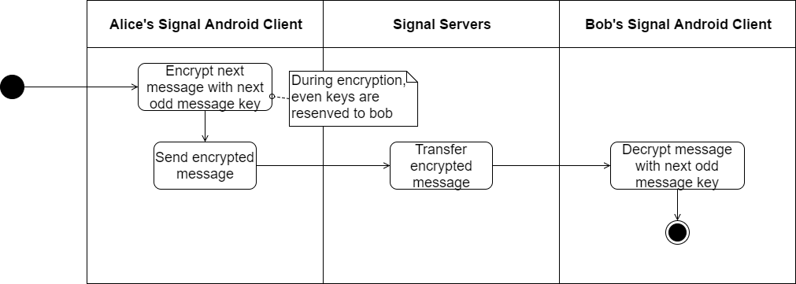
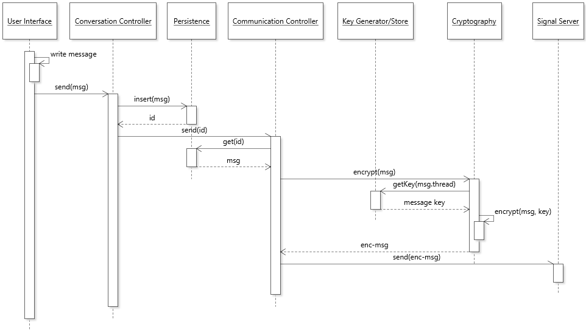
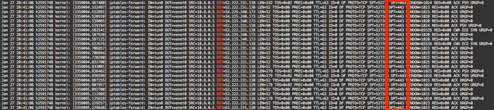

# Functional View

This view describes the system's runtime functional elements and their responsibilities, interfaces and primary interactions.

This view aims at presenting an overview the functional components of Signal in general, and focuses on the particular scenario of sending messages. In particular, streaming features (e.g., voice/video calls) and receiving messages are not specifically addressed by this view.

## System Overview

Signal Android's component are organized into three layers: *Application*, *Jobs*, and *Services*. These layers exist between a layer of the Android Framework (which exists between Signal Android's code and the user) and a layer of communication to other devices (either a local database or local device hardware, through the Android Framework, or Signal's servers).

*In the following figure, large rectangles represent the different layers of Signal Android's architecture, and smaller rectangles represent the functions provided by these layers. Arrows indicate dependencies on a layer's function.*

- **Application Layer:** The application layer contains the main "visible" parts of the application. It contains the activities that creates the different screens of the application, and the broadcast receivers to receive messages. The components of this layer are called by the Android Framework to form the actual application, as seen by the user.
- **Jobs Layer:** Because Signal is developed with [asynchronicity](https://github.com/signalapp/Signal-Android/blob/master/CONTRIBUTING.md#development-ideology) in mind (with the notable exception of streaming tasks, for which this layer is bypassed), activities and receivers delegate most data communication operations to jobs that execute the tasks asynchronously. The Manager receives the jobs to be executed, and schedules their execution.
- **Services Layer:** To complete a task, jobs can depend on a set of static components, included in the lowest layer. These components offer a set of services, such as the generation of keys, or the transmission of messages to Signal's servers. The components of this layer communicate directly to the interfaces of external components, such as the local Android database, or other devices through a WebRTC channel.

## Main Components of the Application

The next model describes the main components of each layer of Signal Android. In this model, layers are divided by bold dashed lines. The stereotype `android` indicates components provided by the Android API, and `external` indicates external components access. For simplicity, some lesser used components or atypical relations are intentionally left out of the model.

### Component List

- **UI Logic:** The UI Logic component encapsulates the front-end logic of the application, i.e., how it interacts with the user. This component is composed of a dynamically changing stack of activities, the most important ones explicitly shown in the model. Due to its large size and complexity, this component is discussed in more details in the [next section](#ui-logic-decomposition).
- **Receivers:** Receivers are the typical Android *broadcast receivers*, that receive messages from the Android Framework and other applications. Like Activities, this component is further subdivided into distinct receivers, although there are fewer receivers than activities. This component follows the [Publish-Subscribe](https://en.wikipedia.org/wiki/Publish%E2%80%93subscribe_pattern) pattern to react to messages, such as the reception of an SMS.
- **UI Resources:** UI Resources consist of XML files, other assets (e.g., images), and some Java classes to build non trivial layouts. Although they are built from XML files following Android's specification about [how to build the user interface](https://developer.android.com/guide/topics/ui/declaring-layout), they are also composed of runtime objects such as custom layouts.
- **Job:** Jobs are short-lived components that represent a single task that must be executed asynchronously. They inherit from Android's [Worker](https://developer.android.com/reference/androidx/work/Worker) class. The jobs are created by activities and broadcast receivers, and sent to the Job Manager. Once a task is completed, the associated job is destroyed.
- **Job Manager:** The Job Manager collects the jobs to be executed, and schedules their execution on background threads. It ensures, for example, that a sequence of jobs is executed synchronously relative to each other.
- **Communication:** The Communication service manages networking tasks for messaging, and voice and video chat. This component is what makes Signal Android a *messaging* application. It communicates with WebRTC ([UDP](https://en.wikipedia.org/wiki/User_Datagram_Protocol)) and Signal's servers ([TCP](https://en.wikipedia.org/wiki/Transmission_Control_Protocol)) [1].
- **Cryptography:** The Cryptography component handles all operations related to the privacy concerns of the application. It creates key pairs, manages these keys, and encrypts and decrypts data. The cryptography service is discussed in details in the [Information View](../4-information/information.md).
- **Persistence:** The Persistence service allows the application to read from and write to the phone's local database, managed by Android. The information that passes through this component includes, for example, messages and attachments from a conversation, and user preferences settings.
- **Hardware Controller:** The Hardware Controller service allows Signal Android to access the phone's devices such as the microphone and camera.

### UI Logic Decomposition

Signal Android is composed of a large set of activities. In the above model, each subcomponent of the large UI Logic component corresponds to a group of closely related activities. Some of these subcomponents are mostly independent from each other:

- **User Profile:** It allows to edit user information, and is accessible from most other screens.
- **User Preferences:** It controls the settings of the application, and is also accessible from most other screens.
- **Registration:** This component is typically only used once, when a user opens the application for the first time, and needs to register themselves to Signal.

The other five subcomponents work in close collaboration to send messages. The interactions shown between these groups of activities are in reality achieved by passing intents through the Android Framework. We model these interactions nonetheless when the lifecycle of a subcomponent is largely dependent on another.

- **Conversation Manager:** Usually the first screen shown when opening the application. It presents to the user the list of existing conversations, and allows to create or delete conversations.
- **Contact Manager:** Used by the Conversation Manager to modify the user's contacts, this group of activities allows to import new contacts or edit existing ones.
- **Conversation:** This group of activities handles a single conversation: it shows the messages in the conversation, and allows to send new messages or calls, using the Message Creation and WebRTC Call subcomponents.
- **Message Creation:** This group of activities can create the various multimedia parts of a message, for example by taking a photo, or selecting an emoji from a list.
- **WebRTC Call:** This subcomponents controls the calls made by the user. Contrary to most other groups of activities, this group needs to execute tasks synchronously, and therefore interacts directly with the Communication service.

**Architecture Style**

Activities are structured using a [Presentation-Abstraction-Control](https://en.wikipedia.org/wiki/Presentation%E2%80%93abstraction%E2%80%93control) (PAC) style, which consists of a set of triads that can each be decomposed into a *Presentation*, and *Abstraction*, and a *Control* part. The *Control* parts of the triads are used to communicate with each other, the *Abstraction* parts hold the information of each triad, and the *Presentation* defines how to display this information.

In Signal, we have the following decomposition for most triads:

- **Control:** The activities represent the Control part of the triads. They communicate with each other (through the Android Framework). The description of the subcomponents of the UI Logic mainly refers to these activities. Activities themselves can be composed entirely or in part of Fragments, which are therefore also included in the Control.

  *E.g.: The Conversation triad is controlled by the [`ConversationActivity`](https://github.com/signalapp/Signal-Android/blob/master/src/org/thoughtcrime/securesms/conversation/ConversationActivity.java) class, which uses a [`ConversationFragment`](https://github.com/signalapp/Signal-Android/blob/master/src/org/thoughtcrime/securesms/conversation/ConversationFragment.java).*

- **Presentation:** The Presentation part of the triads consists mainly of XML files found in the `res/layout/` folder. These files refer to typical GUI elements offered by the Android Framework. For custom GUI elements, Signal Android provides its own classes either extending Android's `View` or `ViewGroup` classes. These components are included in the UI Resources component in the above model.

  *E.g.: The Conversation triad depends on a custom [`InputAwareLayout`](https://github.com/signalapp/Signal-Android/blob/master/src/org/thoughtcrime/securesms/components/InputAwareLayout.java), which inherits from `ViewGroup` (through [`KeyboardAwareLinearLayout`](https://github.com/signalapp/Signal-Android/blob/master/src/org/thoughtcrime/securesms/components/KeyboardAwareLinearLayout.java) and [`LinearLayoutCompat`](https://developer.android.com/reference/androidx/appcompat/widget/LinearLayoutCompat)).*

- **Abstraction:** The Abstraction part of triads can include Java classes, static resource files, or components that use the Persistence service to save information for long term use (e.g., user preferences), as well as abstraction provided by services (Communication, Cryptography, Persistence, Hardware Controller).

  *E.g.: The Conversation triad uses the [`Recipient`](https://github.com/signalapp/Signal-Android/blob/master/src/org/thoughtcrime/securesms/recipients/Recipient.java) class to represent the other user in the conversation.*

The triads communicate with each others through their corresponding activities (i.e., the Control part). Triads are also organized hierarchically, by means of inheritance. The root of the inheritance tree is, of course, Android's Activity class, which handles the lifecycle operations of the triads. One of the major intermediate nodes of the hierarchy is the [`PassphraseRequiredActionBarActivity`](https://github.com/signalapp/Signal-Android/blob/master/src/org/thoughtcrime/securesms/PassphraseRequiredActionBarActivity.java), which is a parent class of many of the most important activities, and handles operations related to the privacy and security concerns.

### Component Implementation

*This table excludes components external to Signal Android. Also, this table points to the source files used to create the functional components that will exist at run-time. In the case of static files (e.g., from UI Resources), it is understood that the related component is built from these files, but is not, in itself, a collection of static resource files.*

| Component                 | Main Classes or Files                                        |
| ------------------------- | ------------------------------------------------------------ |
| **User Profile**          | [`CreateProfileActivity`](https://github.com/signalapp/Signal-Android/blob/master/src/org/thoughtcrime/securesms/CreateProfileActivity.java), [`profiles/`](https://github.com/signalapp/Signal-Android/tree/master/src/org/thoughtcrime/securesms/profiles) |
| **User Preferences**      | [`RecipientPreferenceActivity`](https://github.com/signalapp/Signal-Android/blob/master/src/org/thoughtcrime/securesms/RecipientPreferenceActivity.java), [`ApplicationPreferencesActivity`](https://github.com/signalapp/Signal-Android/blob/master/src/org/thoughtcrime/securesms/ApplicationPreferencesActivity.java), [`preferences/`](https://github.com/signalapp/Signal-Android/tree/master/src/org/thoughtcrime/securesms/preferences) |
| **Registration**          | [`RegistrationActivity`](https://github.com/signalapp/Signal-Android/blob/master/src/org/thoughtcrime/securesms/RegistrationActivity.java) |
| **Conversation Manager**  | [`ConversationListActivity`](https://github.com/signalapp/Signal-Android/blob/master/src/org/thoughtcrime/securesms/ConversationListActivity.java), `ConversationList*` ([`ConversationListAdapter`](https://github.com/signalapp/Signal-Android/blob/master/src/org/thoughtcrime/securesms/ConversationListAdapter.java), [`ConversationListArchiveActivity`](https://github.com/signalapp/Signal-Android/blob/master/src/org/thoughtcrime/securesms/ConversationListArchiveActivity.java), [`ConversationListItem`](https://github.com/signalapp/Signal-Android/blob/master/src/org/thoughtcrime/securesms/ConversationListItem.java), etc.) |
| **Contact Manager**       | [`ContactNameEditActivity`](https://github.com/signalapp/Signal-Android/blob/master/src/org/thoughtcrime/securesms/contactshare/ContactNameEditActivity.java), [`contacts/`](https://github.com/signalapp/Signal-Android/tree/master/src/org/thoughtcrime/securesms/contacts), [`contactshare/`](https://github.com/signalapp/Signal-Android/tree/master/src/org/thoughtcrime/securesms/contactshare) |
| **Conversation**          | [`ConversationActivity`](https://github.com/signalapp/Signal-Android/blob/master/src/org/thoughtcrime/securesms/conversation/ConversationActivity.java), [`conversation/`](https://github.com/signalapp/Signal-Android/tree/master/src/org/thoughtcrime/securesms/conversation) |
| **Message Creation**      | [`CameraActivity`](https://github.com/signalapp/Signal-Android/blob/master/src/org/thoughtcrime/securesms/camera/CameraActivity.java), [`StickerSelectActivity`](https://github.com/signalapp/Signal-Android/blob/master/src/org/thoughtcrime/securesms/scribbles/StickerSelectActivity.java), [`GiphyActivity`](https://github.com/signalapp/Signal-Android/blob/master/src/org/thoughtcrime/securesms/giph/ui/GiphyActivity.java), etc. |
| **WebRTC Call**           | [`WebRtcCallActivity`](https://github.com/signalapp/Signal-Android/blob/master/src/org/thoughtcrime/securesms/WebRtcCallActivity.java) |
| **Message Receivers**     | [`MmsListener`](https://github.com/signalapp/Signal-Android/blob/master/src/org/thoughtcrime/securesms/service/MmsListener.java), [`RemoteReplyReceiver`](https://github.com/signalapp/Signal-Android/blob/master/src/org/thoughtcrime/securesms/notifications/RemoteReplyReceiver.java), etc. |
| **Application Receivers** | [`DeleteNotificationReceiver`](https://github.com/signalapp/Signal-Android/blob/master/src/org/thoughtcrime/securesms/notifications/DeleteNotificationReceiver.java), [`AndroidAutoReplyReceiver`](https://github.com/signalapp/Signal-Android/blob/master/src/org/thoughtcrime/securesms/notifications/AndroidAutoReplyReceiver.java), etc. |
| **UI Resources**          | [`assets/`](https://github.com/signalapp/Signal-Android/tree/master/assets), [`res/layout/`](https://github.com/signalapp/Signal-Android/tree/master/res/layout) |
| **Job Manager**           | [`jobmanager/`](https://github.com/signalapp/Signal-Android/tree/master/src/org/thoughtcrime/securesms/jobmanager) |
| **Job**                   | [`jobs/`](https://github.com/signalapp/Signal-Android/tree/master/src/org/thoughtcrime/securesms/jobs) |
| **Communication**         | [`MessageSender`](https://github.com/signalapp/Signal-Android/blob/master/src/org/thoughtcrime/securesms/sms/MessageSender.java), [`WebRtcCallService`](https://github.com/signalapp/Signal-Android/blob/master/src/org/thoughtcrime/securesms/service/WebRtcCallService.java) |
| **Cryptography**          | [`crypto/`](https://github.com/signalapp/Signal-Android/tree/master/src/org/thoughtcrime/securesms/crypto) |
| **Persistence**           | [`database/`](https://github.com/signalapp/Signal-Android/tree/master/src/org/thoughtcrime/securesms/database) |
| **Hardware Controller**   | [`Camera1Controller`](https://github.com/signalapp/Signal-Android/blob/master/src/org/thoughtcrime/securesms/camera/Camera1Controller.java) |

## Sending Messages

This section presents in more details Signal Android's components related to one of its most important features: sending a message to another Signal user. This particular scenario allows to better understand the interaction between the components, and it is representative of many of the main features of Signal Android.

### Scenario Description

Initial assumptions:

- The user has a network access to Signal's servers, and the message is sent through these servers (i.e., not by SMS/MMS).
- The user has already granted all required permissions to application.
- No exception (e.g., due to key failure) occurs while the message is sent.
- The recipient of the message is a single user (i.e., not a group conversation). [2]
- The focus is on sending the message, not its reception.

### Components Involved in Sending a Message

#### Component List

- **User Interface:** The User Interface is controlled by the Android Framework, based on XML files to indicate what to display to the user. It sends the user events to the Conversation Controller, and updates the information displayed to the user.
- **Conversation Controller:** The Conversation Controller prepares the message that needs to be sent (formatting it and wrapping it with metadata), and saves it to the local database. It updates the User Interface with the status information of the message.
- **Communication Controller:** The Communication Controller handles the operations to send the message. It sends a request for chat target's prekeys. And it send a command to Key Generator to generate keys after receiving prekeys. It loads the message from the Persistence service, relies on the Cryptography service to encrypt the message, and pushes the encrypted message to Signal's servers. It relies on the [libsignal service](https://github.com/signalapp/libsignal-service-java) library to connect to Signal's servers.
- **Cryptography:** The Cryptography service encapsulates the encryption and decryption algorithms and manages the keypairs. It relies on the [Signal Protocol](https://github.com/signalapp/libsignal-protocol-java), because the encryption must be consistent for all Signal clients.
- **Key Generator/Store:** The Key Generator generates session keypair and derive symmetric message keys. Public session key will be sent with the first encrypted message only, and symmetric message keys will be used to encrypt every message being transmitted. 
- **Persistence:** The Persistence service stores and retrieves messages in the local Android SQLite database. It depends on the [SQLCipher for Android](https://www.zetetic.net/sqlcipher/sqlcipher-for-android/) library to connect to the local database.

*Note: The Job layer is not depicted in this model, because its only impact is to delay the execution of the task, so that the application can remain responsive, as explained the the previous section. In this model, it is understood that the connection between Conversation Controller and Communication Controller is made through the job layer.*

#### Component Implementation

| Component                    | Classes or Files                                             |
| ---------------------------- | ------------------------------------------------------------ |
| **User Interface**           | Android Framework ([supported by XML layout files](https://github.com/signalapp/Signal-Android/tree/master/res/xml)) |
| **Conversation Controller**  | [`ConversationActivity`](https://github.com/signalapp/Signal-Android/blob/master/src/org/thoughtcrime/securesms/conversation/ConversationActivity.java) |
| **Communication Controller** | [`MessageSender`](https://github.com/signalapp/Signal-Android/blob/master/src/org/thoughtcrime/securesms/sms/MessageSender.java), [`PushTextSendJob`](https://github.com/signalapp/Signal-Android/blob/master/src/org/thoughtcrime/securesms/jobs/PushTextSendJob.java) |
| **Crytography**              | [`crypto`](https://github.com/signalapp/Signal-Android/tree/master/src/org/thoughtcrime/securesms/crypto) package |
| **Key Generator/Store**      | [`AsymmetricMasterCipher`](https://github.com/signalapp/Signal-Android/blob/master/src/org/thoughtcrime/securesms/crypto/AsymmetricMasterCipher.java), [`crypto/storage`](https://github.com/signalapp/Signal-Android/tree/master/src/org/thoughtcrime/securesms/crypto/storage) package for the KeyStores |
| **Persistence**              | [`database`](https://github.com/signalapp/Signal-Android/tree/master/src/org/thoughtcrime/securesms/database) package, in particular [`SmsDatabase`](https://github.com/signalapp/Signal-Android/blob/master/src/org/thoughtcrime/securesms/database/SmsDatabase.java) |

### Key Exchange

Given the focus of Signal Android on privacy and security, this section describes in more details how the Communication Controller, the Cryptography and Persistence services, and the Key Generator work together to send messages, by following a complex key exchange protocol.

#### Key Types

The [Information view](../4-information/information.md) describes in more details the role and purpose of the different key types. However, as a reminder, we list the main characteristics of the three kinds of keys used for the key exchange protocol.

- *Prekeys* are unique [public/private keypair bundle](../appendices/cryptography.md#asymmetric-encryption) associated with each user. The public part serves as identifier. The *Prekeys* only change if a user re-registers.
- *Session Keys* are [public/private keypairs](/appendices/cryptography.md#asymmetric-encryption), bound to a conversation between two specific users. Session keys can be renewed at any time.
- *Message Keys* are [symmetric keys](/appendices/cryptography.md#symmetric-encryption), used to protect individual messages, exchanged between two users. No key is used for more than one message.  

#### Phases

Key exchange and user communications are partially interleaved. We distinguish between the three following phases:
 * Phase 1, [*Registration*](#phase-1-registration). Key types involved: *Prekeys*.
 * Phase 2, [*Creating a session*](#phase-2-creating-a-session). Key types involved: *Prekeys*, *Session Keys*, *Message Keys*.
 * Phase 3, [*Communication*](#phase-3-communication). Key types involved: *Message Keys*.

The following models are simplified abstraction of the protocol [3].

##### Phase 1: Registration

The goal of the first phase is to register the public part of the user's prekeys at Signal's servers. This phase applies only once per user, when the user registers their phone with Signal for the first time.

  *Figure: Clients register prekeys at keyserver.*

##### Phase 2: Creating a session

The goal of the second phase is to produce a set of *message keys*, and share it between Alice and Bob. This phase applies only once at the start of each new conversation [4]. The individual steps are:  
  1. Alice retrieves Bob's prekeys from a Signal server. 
  2. Alice generates her session keypair, using Bob's prekeys. 
  3. Alice uses the generated session key to derive message keys. 
  4. Alice encrypts a first payload message, using the first message key. 
  5. Alice sends the first payload message (encrypted with the first message key) alongside her unencrypted public session key to Bob. 
  6. Bob retrieves Alice's prekeys from a Signal server. 
  7. Bob reconstructs the message keys, using his own private prekey and Alices public session key. 
  8. Bob uses the first message key, to decrypt Alice's first payload message. 

*Figure: Alice initiates a new session with Bob.*

Although it is not shown in this diagram, Bob will also generate his own pair of session keys (which is not used to generate the first set of message keys), and send his public session key to Alice together with the first payload message he sends to Alice. This detail is important for Alice and Bob to be able to generate new message keys when needed, without requiring to fetch again each other's prekeys. A complete description of this process, however, is out of the scope of this view.

The mutual exchange of session keys has two advantages:

 * It allows [forward secrecy](../appendices/cryptography.md#Forward-secrecy), because even if session keys are compromised, the content of individual messages is not exposed. (Messages are encrypted with derived message keys).
 * In the future, new message keys can be generated and exchanged, without exchanging prekeys again.

##### Phase 3: Communication

Phase 3 typically does not involve further key exchanges. In the most common case, clients simply exchange messages, using the previously generated message keys. Alice and Bob, after sending their first message to each other, will remain in this phase.

*Figure: Alice and Bob communicate, using only message keys.*

The default strategy to avoid double-usage of individual keys is to reserve keys at odd position for Alice and keys at even positions for Bob. This way asynchronous communication does not risk to reuse a single key twice.

### Sequence of calls to encrypt and send a message

To summarize all the information presented in this section, the following sequence diagram illustrates how the functional components (of Alice's application) send a message (in Phase 3).

Note that the Conversation Controller will first save the content of a message locally, then indicate to the Communication Controller to fetch the content and send it, so the Conversation Controller never directly sends the message content to the Communication Controller.

Note also the asynchronous call between the Conversation Controller and the Communication Controller, so that the User Interface and Conversation Controller are not blocked until the message is sent.

## End Notes

[1] Packet-monitoring of outbound traffic of a Signal-client. The 443 port indicates SSL encrypted data.  

[2] This assumption is important because group conversations need to make the ordering of messages clear for all group members to show a consistent timeline. This concern is not present in One-to-One conversations. For the processing (and ordering algorithms) of group messages, see the [`GroupMessageProcessor`](https://github.com/signalapp/Signal-Android/blob/master/src/org/thoughtcrime/securesms/groups/GroupMessageProcessor.java) file.

[3] Descriptions in this section are based on [an article](https://eprint.iacr.org/2016/1013.pdf) that accurately describes the cryptographic handshake in more detail.

[4] If users feel that the session keys may have been compromised, they can force Signal Android to abandon the current session keys, in which case Phase 2 will be entered again for an existing conversation.
