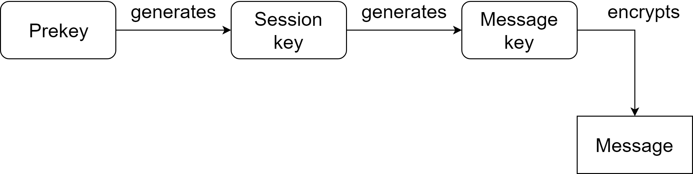
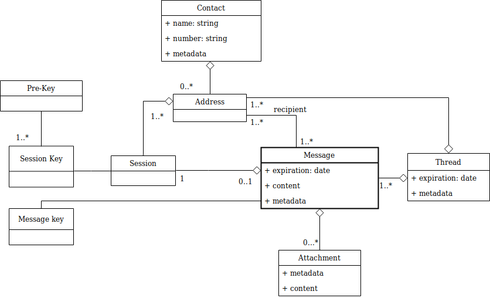
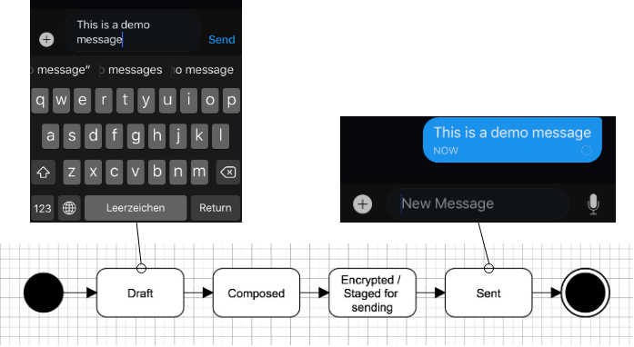
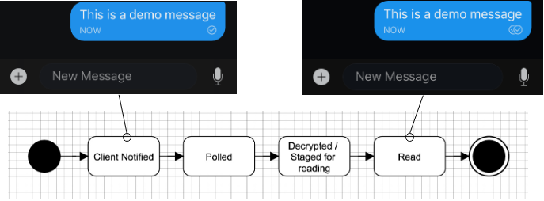
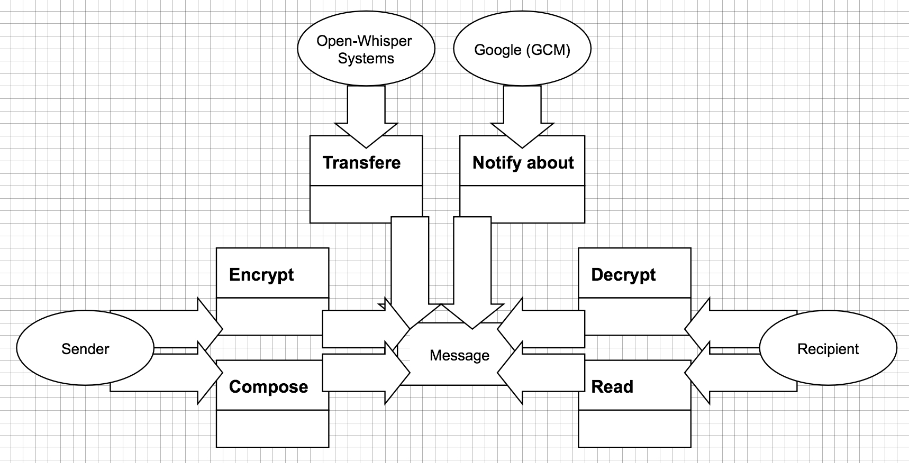

# Information View

This view describes how information is handled by Signal Android to respect the [Privacy-by-Design](https://www.esat.kuleuven.be/cosic/publications/article-1542.pdf) principle, in particular by implementing [end-to-end encryption](../appendices/cryptography.md/#end-to-end-encryption) (E2EE).

## Key Management

This section presents a static view of how keys are handled by Signal, both through the key exchange protocol and for the encryption of message elements.

### Key Types 

|                                      | Symmetric Encryption | Asymmetric Encryption |
| ------------------------------------ | -------------------- | --------------------- |
| **Persistent (not usually changed)** | Storage Key          | Prekey                |
| **Ephemeral (changed regularly)**    | Message Key          | Session Key           |

**Relation to Source Code**

| Component                   | Main Classes or Files                                        |
| --------------------------- | ------------------------------------------------------------ |
| **Database Key**            | [`MasterCipher`]()                                           |
| **Ephemeral Key**           | [`DeviceListLoader`](https://github.com/signalapp/Signal-Android/blob/master/src/org/thoughtcrime/securesms/database/loaders/DeviceListLoader.java), [`AsymmetricMasterCipher`](https://github.com/signalapp/Signal-Android/blob/master/src/org/thoughtcrime/securesms/crypto/AsymmetricMasterCipher.java) |
| **Session Key**             | [`libsignal-protocol-java`](https://github.com/signalapp/libsignal-protocol-java) |
| **Public Key Bundle**       | [`libsignal-protocol-java`](https://github.com/signalapp/libsignal-protocol-java), [`PreKeyUtil`](https://github.com/signalapp/Signal-Android/blob/master/src/org/thoughtcrime/securesms/crypto/PreKeyUtil.java) |
| **Private and Public keys** | [`src.org.thoughtcrime.securesms.crypto`](https://github.com/signalapp/Signal-Android/tree/master/src/org/thoughtcrime/securesms/crypto) |

#### Dependencies between Key Types



#### Entity Catalog

- **Pre-Key**: Keys that are retrieved from the Signal's server and are used to generate a session key by the sender. They are registered in bulk when the user signs in for the first time.
- **Session Key**:  This is a key which serves as a basis for generating a message key.
- **Message key**: This is the key that is used to encrypt a message.
- **Message**: This component represents data that is being encrypted and sent to a user.

#### Mapping of Entities on Code Artifacts

| Component             | Main Classes or Files                                        |
| --------------------- | ------------------------------------------------------------ |
| **Pre-Key** | [`PreKeyUtil`](https://github.com/signalapp/Signal-Android/blob/master/src/org/thoughtcrime/securesms/crypto/PreKeyUtil.java), [`RegistrationActivity`](https://github.com/signalapp/Signal-Android/blob/master/src/org/thoughtcrime/securesms/RegistrationActivity.java) |
| **Session Key**       | [`libsignal-protocol-java`](https://github.com/signalapp/libsignal-protocol-java) |
| **Message Key**       | [`libsignal-protocol-java`](https://github.com/signalapp/libsignal-protocol-java) |

### Entity-Relationship Model about Media Encryption

We chose an ER diagram to illustrate the multiplicities between abstract elements related to key management and message de/encryption.  This model outlines the involved entities in the context of key and message storage.



**Evolution Insight.** The implementation of this model has been tested with the addition of a new feature to perform *full encrypted backups*. The addition of this feature and its implication the handling of data elements is described in the traces of our [evolution perspective](../AD-development/evolution.md#Full-Backup).

#### Entity Catalog

 * **Contact:** Signal can load contacts from the phone and use them for contact discovery on its servers.
 * **Address**: It's an address belonging to a particular identity to which encrypted media for this identity are sent.
 * **Threads**:  Exchanged information can be grouped into threads where each thread can be set to expire. It's used as an aggregation structure for the media. It's similar to conversations in Messenger and other mainstream chat applications.
 * **Message**: This component represents a message that can be sent between users in signal. A particular feature that Signal offers is that each media has an expiration attribute attached to it. This attribute is used to delete old media automatically, minimizing storage retained by the application.
 * **Attachment:** This component represents possible attachments that can be included into a message. Attachment is used for sending large chunks of data such for images/gifs and files. Each attachment is encrypted with a separate attachment secret.
 * **Session:** Session refers to the communication between participants. Each message on the session is encrypted with a different symmetric key that is established by Signal Protocol ephemeral key exchange. The resulting symmetric keys for encryption/decryption are kept in memory and are delete when they are no longer needed. Thus architectural element of session has a reference to multiple symmetric keys  but these symmetric keys are not stored on the device.
 * **Message key:** This component represents an ephemeral key that is used to encrypt every single message.
 * **Session key:** This is a key that is used in key exchange initiation phase.

#### Mapping of Entities on Code Artifacts

| Component       | Main Classes or Files                                        |
| --------------- | ------------------------------------------------------------ |
| **Contact**     | [`DirectoryHelper`](https://github.com/signalapp/Signal-Android/blob/master/src/org/thoughtcrime/securesms/util/DirectoryHelper.java), [`src.org.thoughtcrime.securesms.contacts`](https://github.com/signalapp/Signal-Android/tree/master/src/org/thoughtcrime/securesms/contacts), [`src.org.thoughtcrime.securesms.contacts.share`](https://github.com/signalapp/Signal-Android/tree/master/src/org/thoughtcrime/securesms/contactshare) |
| **Address**     | [`Address`](https://github.com/signalapp/Signal-Android/blob/master/src/org/thoughtcrime/securesms/database/Address.java) |
| **Threads**     | [`ThreadDatabase`](https://github.com/signalapp/Signal-Android/blob/master/src/org/thoughtcrime/securesms/database/ThreadDatabase.java), [`ConversationActivity`](https://github.com/signalapp/Signal-Android/blob/master/src/org/thoughtcrime/securesms/conversation/ConversationActivity.java) |
| **Message**     | [`SmsDatabase`](https://github.com/signalapp/Signal-Android/blob/master/src/org/thoughtcrime/securesms/database/SmsDatabase.java), [`MmsDatabase`](https://github.com/signalapp/Signal-Android/blob/master/src/org/thoughtcrime/securesms/database/MmsDatabase.java), [`src.org.thoughtcirem.securesms.database`](https://github.com/signalapp/Signal-Android/blob/master/src/org/thoughtcrime/securesms/database) |
| **Attachment**  | [`AttachmentDatabase`](https://github.com/signalapp/Signal-Android/blob/master/src/org/thoughtcrime/securesms/database/AttachmentDatabase.java), [`AttachmentUtil`](https://github.com/signalapp/Signal-Android/blob/master/src/org/thoughtcrime/securesms/util/AttachmentUtil.java) |
| **Session**     | [`SessionUtil`](https://github.com/signalapp/Signal-Android/blob/master/src/org/thoughtcrime/securesms/crypto/SessionUtil.java), [`SessionDatabase`](https://github.com/signalapp/Signal-Android/blob/master/src/org/thoughtcrime/securesms/database/SessionDatabase.java),  [`libsignal-protocol-java`](https://github.com/signalapp/libsignal-protocol-java/tree/master/java/src/main/java/org/whispersystems/libsignal/state) |
| **Message Key** | [`libsignal-protocol-java`](https://github.com/signalapp/libsignal-protocol-java) |
| **Session Key** | [`libsignal-protocol-java`](https://github.com/signalapp/libsignal-protocol-java) |


## Encrypted Messaging

This section presents a dynamic view of the information flow in Signal Android.

### User-Visible Information Flow

The following two UML state diagrams describe the state changes related to the transmission of encrypted messages, as seen by the users. For this section, we assume the typical case where a message is sent from one device (*Device A*), and received on another (*Device B*), using an encrypted channel.

#### Sending the Message



The above UML State Diagram illustrates the key phases a message goes through, from the moment of its creation, to the moment it leaves the sending unit, *Device A*:

- **Draft**: From the moment the user starts typing on his virtual keyboard, the message is internally handled as a ```Draft```. A draft is always attached to a specific conversation. Despite the fact that the draft can be edited, the far end is notified about the existence of a draft. This is typically indicated by a stub message ```...``` in the recipients conversation interface.

- **Composed**: As soon as the user hits the ```send``` icon the draft is message is considered ```Composed```. Composed messages are no longer modifiable. Despite the send-icon the message is not yet transmitted.
- **Encrypted / Staged for sending**: The message is encrypted into a cypher message. Once the encryption is completed the message is ready to be sent.
- **Sent**: As soon as the message is sent to Signal's servers, the message-pipeline ends for the sending device. An empty dashed circle is displayed behind the message, in the sender’s UI.

#### Receiving



The above UML State Diagram illustrates the key phases a message goes through on the receiving end, from learning about its existence to being displayed on the screen of *Device B* (the screenshots shows the visual feedback on *Device A*).

- **Client Notified**: As soon as Signal's servers receive an outbound message, they trigger a notification of the target client. Note that the message is not directly transferred to the recipient. Instead, Signal's servers notify the target device using Android's proprietary Push Notification Service (PNS), the Google Cloud Messaging (GCM) service [1]. The sending device receives an ```ACK``` from the servers, indicated with an additional ```tick```.

- **Polled**: Inbound Push Notifications wake up the Signal process on the recipients device and indicate that there is a new message waiting for retrieval. The target client polls Signal's servers for new messages. *Note: Signal provides a fallback mechanism to privacy aware users who removed **Google Play Services** from their phone [2].*
- **Decrypted / Staged for reading**: Once the cypher message was transmitted to *Device B* it gets decrypted into a plain-text readable message. This transition also triggers a sound and/or vibration on the phone to notify the target user of the newly arrived message.
- **Read**: The target user opens the conversation in his application to read the message. The message is now considered ```read``` and an addition ```ACK``` is sent back to Signal's servers, and then to the message sender. The sending device displays this information with an additional ```tick``` next to the message.

### Internal Data Flow

The following diagram presents the data flow between the important architectural elements of Signal Android.


*Figure: Data Flow Diagram - The arrows indicate the dependencies between data-entities, as they are reflected in the source code. Messages are the central entity that everything else in some way refers to.*

 * **Sender:Compose**: A UI element that handles the composition of new messages. We stipulate the existence of an abstract element ```Conversation UI```.
 * **Sender:Encrypt**: An abstract element that handles the encryption of outbound messages. We name it ```Encoder```, in alignment to the initial sketch.
 * **Open-Whisper-Systems:Transfer**: The server infrastructure that handles the exchange of messages between clients. We do not define a dedicated architectural element for this part, for it is outside the scope of the android client. Though more explanations on this part are in the next section.
 * **Google/GCM:Notify About**: A mechanisms needed for push notifications. Again we will not define an extra architectural element for this part, as it is out of scope. The next section also covers more insight on this part.
 * **Recipient:Decrypt**: An abstract element that handles the decryption of received messages, we name it ```Decoder```, in alignment to the initial sketch.
 * **Recipient:Read**: A UI artifact on client side that handles the display of received messages. We attribute this functionality to ```Conversation UI```.

#### Architectural Elements

Following the above models we identify the following main architectural elements:

 * **Encoder**: Responsible for encrypting plain messages to cypher messages. Uses the recipient's public key, provided by the local keystore.
 * **Decoder**: Responsible for decrypting cypher messages to plain messages. Uses the private secret key, guarded by the local keystore.
 * **Keystore**: Maintains public keys of all communication partners and a single private key.
 * **Communication UI**: Offers graphical interfaces for composition and reading of messages.
 * **Sender**: Responsible for transmission of encrypted message to the signal servers.
 * **Receiver**: Responsible for an active retrieval of messages, queued at the signal servers. Note that no unit for actively incoming messages is needed, for the polling is triggered by OS-maintained wake-up calls (Push-notifications). 

| Component            | Main Classes or Files                                        |
| -------------------- | ------------------------------------------------------------ |
| **Encoder/Decoder**  | [`textsecure library`](https://open-whisper-systems.readme.io/docs/textsecure-java-library) |
| **Keystore**         | [`DomainFrontingTrustStore`](https://github.com/signalapp/Signal-Android/blob/master/src/org/thoughtcrime/securesms/push/DomainFrontingTrustStore.java) |
| **Communication UI** | [`org.thoughtcrime.securesms`](https://github.com/signalapp/Signal-Android/tree/master/src/org/thoughtcrime/securesms) |
| **Sender**           | [`MessageSender`](https://github.com/signalapp/Signal-Android/blob/master/src/org/thoughtcrime/securesms/sms/MessageSender.java) |
| **Receiver**         | [`org.thoughtcrime.securesms.jobs`](https://github.com/signalapp/Signal-Android/tree/master/src/org/thoughtcrime/securesms/jobs) |


## End Notes

[1] Actively pushing the message to the destination client would require a reliable socket-connection. This can not be assumed, for mobile operating systems tend to [kill inactive applications and mobile connectivity is flicky by nature](https://www.infoq.com/presentations/Android-Design/)(8:45 min). Instead Android phones by default have *Google Play Services* installed. Those provide a *socket like* always on connection to Google servers. Dropouts are detected automatically, using heartbeats. Broken connections are tried to be reestablished as soon as possible. The philosophy in behind is to rather handle a single OS-wide reliable socket connection (using the *Playservices Framework*) than having each application maintain it's own socket. This results in less network traffic and a lower power consumption.

[2] In case no PNS framework is installed on the phone, the application runs its own always-on socket connection to the signal servers. Internally websockets are used to obtain an asynchronous connection. Earlier versions of signals without this fallback had the classic *you-wrote-me-but-my-phone-did-not-ring bug*, which would delay the polling process until the user actively opened his phone.
