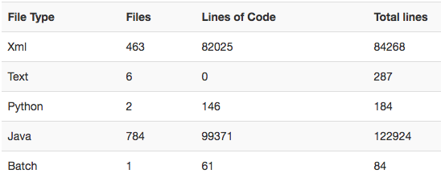
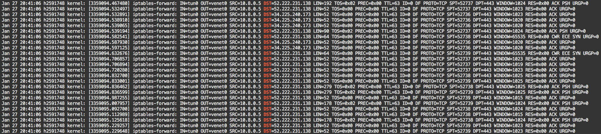

# Code Exploration Strategies

## Motivation

Signals Android app is an application with ~100k lines of java code. Given this number and our relatively small team, required the use of sophisticated strategies and tools for an effective code exploration.  
.  
*The table was created with [line-count.herokuapp.com](line-count.herokuapp.com)*

## Methodology

Main goal of the code exploration we conducted for this architectural description, was to identify a meaningful selection of architectural elements. Furthermore we are interested in the wiring and interplay of those identified modules. The techniques and tools described below allowed an efficient code-understanding, faster as it would have been the case with only classic code inspection. The strategies applied, can be divided into three orthogonal approaches:
 * [Understanding the application from a user-perspective](#acquisition-of-the-users-perspective)
 * [Finding a mapping of key functionalities on code artifacts](#identify-key-functionalities-and-corresponding-code-units)
 * [Identifying common scenarios](#functional-sequences-and-call-stacks)

## Acquisition of the users perspective

The first step was for every team member to install the android application on a personal devices. Exploration in a playful manner was a fast way to discover the most common usage scenarios. Especially functional scenarios are an efficient way to quickly gain an understanding of outstanding concepts and functionalities. Though the architectural analysis was delimited to the android client, it was useful to compare it to implementations for other platforms. Differences in functionality and behavior indicated architectural challenges, e.g. to ensure platform independence. 

## Identify key functionalities and corresponding code units

 The following strategies altogether focus on a better understanding of key functionalities and their mapping on corresponding code units.

### Decomposition

A straightforward approach to better understande code, is to analyze how sources are organized into macro modules. While a simple package strugture may suggest some hints on applied architectural patters, more sophisticated decomposition tools can reveal way more insight than a classic package explorer. We were not only interested in the grouping of classes into packages, but also in class hierarchies (inheritance) and dependencies. Therefore we inspected visual representations of packages an dependencies, generated with CodeMR.  
On behalf of dependency explorations between code artefacts, we also inspected specific configuration files in the codebase. As Signal’s android client internally relies on the dependency-injection framework [DAGGER](https://google.github.io/dagger/), those files itself provided insight on the wiring of architectural elements. [[1]](#endnotes) 

### Networking and Server-APIs

For the application we inspect is only the client-side of a client-server architecture, we are also intersted in the interfaces defined for their communication. We do not want to provide an architectural description of the server, as we thing the client is reasonably complex for it be the single subject to our study. However the interface definitions should give us a better understanding of architectural concepts that were integrated to ensure platform independence. There are two ways to approach these interfaces. Firstly we can simply search the code for network-related functionality. Secondly we can run the application behind a network-filter and monitor its communication. This could be done on different layers of the network stack. We could go down to an TCP/DNS layer and trace the connection attempts to remote IPs and domains, e.g. by routing the phones traffic through a VPN with NAT configured IP-Tables at the other side. A quick viability test showed upcoming outward connections on interaction with the signal app.  
  
A more elaborate attempt would be to launch a monitoring software like [wireshark](https://www.wireshark.org/). However we think this will be of limited use to inspect the data exchanged between client and server, for the IPtabled log already showed that data is exchanged over port 443, the default port for SSL encrypted data. This most likely rules out the possibility for a deep packet inspection.  

### Encryption, Privacy, Security 

We did not find a lot of documentation, but right at the heart of Signal seems to an evolution of [OTR](https://crypto.stackexchange.com/questions/40659/what-is-the-difference-between-otr-and-signal-protocols), named the “Signal Protocol”. This protocol is likewise used by WhatsApp. According to the [Privacy-by-Design](https://www.esat.kuleuven.be/cosic/publications/article-1542.pdf) philosophy, security and privacy concerns cannot be integrated into a software project retrospectively, they have to be considered within the architecture. Therefore we find it straightforward to first obtain a better understanding of the applied security protocols, which implicitly dictated many design decisions. An example at this point is the design decision to use end-to-end encryption for all chats. This implicily means the entire encryption-decryption related code must reside in the clients. However there are further aspects to be considered, such as key management for linked devices and a privacy aware contact-comparison.  

### Complexity analysis by Profiling

Finally a good indicator for essential building blocks are the ressources consumed by individual functionalities.  A method consuming significant CPU time or claiming much memory is likely to contribute a significant functionality to the application. We therefore hope to identify essential functionalities by a resource-oriented view on the running application. This can be achieved with a profiler. In the past we have made good experience with the trial verison of the [“YourKit” java profiler](https://www.yourkit.com/java/profiler/). However it might be of limited use for an android project.  

## Functional Sequences and Call Stacks

Once the major functional components are identified, we try to put them into relation. We will do so using stakeholder-centrist sequence diagrams. Partially the diagrams can be generated with ObjectAit and UMLet. However generated diagrams often are not at an adequate abstraction level. We will therefore focus only on the most outstanding generated diagrams and then further refine them manually.  

# Endnotes

[1] Due to the limited resources of mobile devices DAGGER does not rely on reflection or autowired injections. Instead is uses [textual configuration files for the wiring](https://github.com/signalapp/Signal-Android/blob/master/proguard-dagger.pro).  
