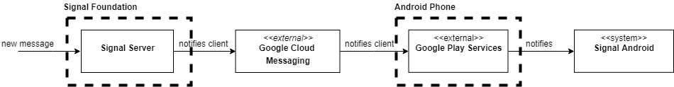
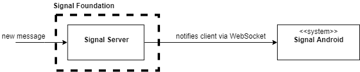
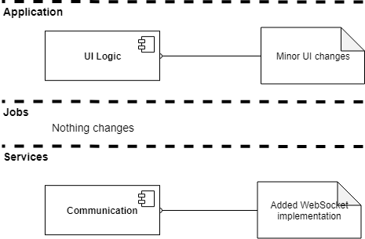

# Traces of a Retrospective Application of the Evolution Perspective

## Historic Changes Considered

1. **Full Backup:** The addition of a new feature, the ability to perform full encrypted backups, to Signal Android, and its privacy and security implications.
2. **Integration of WebSockets:** The addition of a WebSocket to send push notifications for Signal Android users that don't want to rely on Google services, and its functional implications.

## Full Backup

### Needs

User data is stored on the client side in Signal. However, users might want to switch their phones, use a different Signal client, and have access to all of the media shared in a previous Signal conversations including message threads.

Originally Signal only allowed to export plain text messages. However, it would export plain text messages and omit any media and messages that contained media as if they were not there. A user has opened [an issue](https://github.com/signalapp/Signal-Android/issues/1619) on GitHub about this on June 19, 2014. This issue has evolved into a full encrypted backup feature request in 2017 and can be seen in [top of requested features](https://community.signalusers.org/t/whats-your-most-missed-feature-ranking/1286).

This feature was one of the reasons that kept many people from switching to Signal, or made them move away from it, since a proper backup required to do export/import manually or to use unofficial versions of Signal to build a workaround. Full solution for full encrypted backup has been provided on February 26th, 2018.

### Modifications involved

Signal Android implemented full backup in [v3.17.0](https://github.com/signalapp/Signal-Android/commit/24e573e537639f6f8ff40fd774cf9ff079bbacce).   The backup is exported/imported from an SD card.

Prior to this implementation, the persistence service was modified to keep necessary information for the encrypted full backup in databases. Most notably [`SessionDatabase`](https://github.com/signalapp/Signal-Android/commit/9f6b761d9888a2cd62c7bc0e8154c883871a62d5) had to be added and [`PreKeyDatabase`](https://github.com/signalapp/Signal-Android/commit/9f6b761d9888a2cd62c7bc0e8154c883871a62d5)  had to be modified.

Export of a backup starts with a [`BackupDialog`](https://github.com/signalapp/Signal-Android/blob/24e573e537639f6f8ff40fd774cf9ff079bbacce/src/org/thoughtcrime/securesms/backup/BackupDialog.java) that notifies [`LocalBackupListener`](https://github.com/signalapp/Signal-Android/blob/24e573e537639f6f8ff40fd774cf9ff079bbacce/src/org/thoughtcrime/securesms/service/LocalBackupListener.java) which triggers  [`LocalBackUpJob`](https://github.com/signalapp/Signal-Android/blob/24e573e537639f6f8ff40fd774cf9ff079bbacce/src/org/thoughtcrime/securesms/jobs/LocalBackupJob.java) that calls exporting logic in  [`FullBackupExporter`](https://github.com/signalapp/Signal-Android/blob/24e573e537639f6f8ff40fd774cf9ff079bbacce/src/org/thoughtcrime/securesms/backup/FullBackupExporter.java). The backup file is encrypted with [30-digit passphrase](https://support.signal.org/hc/en-us/articles/360007059752) that is auto generated and displayed to the user. User needs to remember it in order to restore from the encrypted backup.

Import of a backup starts with [`RegistrationActivity`](https://github.com/signalapp/Signal-Android/blob/24e573e537639f6f8ff40fd774cf9ff079bbacce/src/org/thoughtcrime/securesms/RegistrationActivity.java)  which uses logic in [`FullBackupImporter`](https://github.com/signalapp/Signal-Android/blob/24e573e537639f6f8ff40fd774cf9ff079bbacce/src/org/thoughtcrime/securesms/backup/FullBackupImporter.java) to perform import of a backup file.

This implementation required changes to database handling logic which involved access modification to certain database fields in [`AttachmentDatabase`](https://github.com/signalapp/Signal-Android/blob/24e573e537639f6f8ff40fd774cf9ff079bbacce/src/org/thoughtcrime/securesms/database/AttachmentDatabase.java) and to methods in [`DatabaseFactory`](https://github.com/signalapp/Signal-Android/blob/24e573e537639f6f8ff40fd774cf9ff079bbacce/src/org/thoughtcrime/securesms/database/DatabaseFactory.java). Also, crypto logic had to be extended to handle 30-digit-passphrase for backup/restore. GUI elements for triggering these operations had to be added in [`RegistrationActivity`](https://github.com/signalapp/Signal-Android/blob/24e573e537639f6f8ff40fd774cf9ff079bbacce/src/org/thoughtcrime/securesms/RegistrationActivity.java) and [`BackupDialog`](https://github.com/signalapp/Signal-Android/blob/24e573e537639f6f8ff40fd774cf9ff079bbacce/src/org/thoughtcrime/securesms/backup/BackupDialog.java).

#### Insights and new decisions

Session keys had to be moved into a database so that when the backup is restored user can continue existing conversations without creating new message threads and performing key exchange all over again.

The choice of backing files to an SD card is due to the fact that Android would delete files belonging to an application if the application is [uninstalled](https://developer.android.com/guide/topics/data/data-storage.html#filesInternal). In addition, backup file grows in size as the user uses the application so it makes sense to save the data to an external storage since local client might not have enough  of internal memory for it.

The backup import is only possible on the [clean installation](https://support.signal.org/hc/en-us/articles/360007059752) of Signal application. It makes merging of information between current and backup data impossible. The reason for this decision is not mentioned in a commit message. We suspect that it's implemented like this because merging logic might be too complicated to do.

The decision for querying database files and building a backup file instead of just copying database files as a backup file makes sure that platform specific format requirements are isolated and any changes to the database formatting file on Android are not propagated to other Signal clients.

The location of backup option in user preferences has lead to [re implementation of this feature](https://github.com/signalapp/Signal-Android/pull/7380) and people creating issues about [the missing feature](https://github.com/signalapp/Signal-Android/issues/7473) when in fact it was implemented. Unfortunately this has never been merged even though it has better UI for it.

## Integration of WebSockets

As explained before in context model, Signal's new message notification feature depends on Google services.

Signal Server plays an important part in message delivery. Client cannot send the message directly to the target client as the target client IP is a secret. In order to deliver a message, client first sends the message to the server, the server caches the message in a message queue and notifies the target about the incoming message, so the target can come fetch the message.

Signal Server sends push notification to Signal Android using Google Cloud Messaging service, which depends on Google Play Services in the Android system.  

### Needs
Google service may not always be available, it is actually banned in countries like China. Not every Android phone has pre-installed Google Play Services as some third party phone manufacturer customizes the Android ROMs. Additionally, some privacy concerned users may opt out of Google services as Google is plagued by [data and privacy issues](https://hackernoon.com/data-privacy-concerns-with-google-b946f2b7afea).

Users opened [issues](https://github.com/signalapp/Signal-Android/issues/7638) in GitHub to report that the new message notification feature would not work if Google Service is absent. [Request](https://github.com/signalapp/Signal-Android/issues/1000) for non-GCM (Google Cloud Messaging) support is submitted back in 2014. There was even [fork](https://github.com/LibreSignal/LibreSignal) developed to support non-Google users. Apparently there is a need for a Google-free solution.

### Modifications involved

Official Signal Android supports non-GCM users by providing a fallback [WebSocket solution](https://github.com/signalapp/Signal-Android/commit/1669731329bcc32c84e33035a67a2fc22444c24b) starting from v3.30.0.

When Signal Android detects that Google services are not functioning properly in the user's device, it will establish a WebSocket connection with the server. As WebSocket supports bi-directional messaging, Signal Server is able to send push notification to client.

The WebSocket implementation is mainly in [service/MessageRetrievalService.java](https://github.com/signalapp/Signal-Android/commit/1669731329bcc32c84e33035a67a2fc22444c24b#diff-9c046c6a5dc41570be2a81403504b78d), a part of Communication Service in the functional model.

### Insights and new decisions

The WebSocket solution is far from an ideal solution. It's much more battery consuming and unreliable on poor network condition (see this [issue](https://github.com/signalapp/Signal-Android/issues/6732)).

As explained by the Signal team:
_Keeping an application awake in the background non-stop while sending keep-alives to make a network connection stay awake is fundamentally going to cause battery drain. By contrast, GCM can be mostly idle, since they've negotiated idle connection windows with carriers around the world._

To address the privacy concerns with Google services, Signal only uses Google services to send notification, the actual message content is never passed to Google services.

Nevertheless, as a fallback solution, the WebSocket implementation fulfilled its role.

On the implementation side, the new feature does not require any major refactoring. Changes are mainly contained in the services files due to proper modularization. As mentioned in the functional model, the system is decomposed to 3 layers: Application, Jobs, Services.

As Application and Jobs are decoupled from service implementation, these two layers can remain basically intact. There are only some very minor UI changes in UI Logic (i.e. modify the content of warning dialog for missing Google Play Services). These two layers are essentially uninformed about the new WebSocket fallback solution.

Since services in Service layer are decomposed to components with little inter-dependencies. Changes are contained in only one service component: Communication.   
