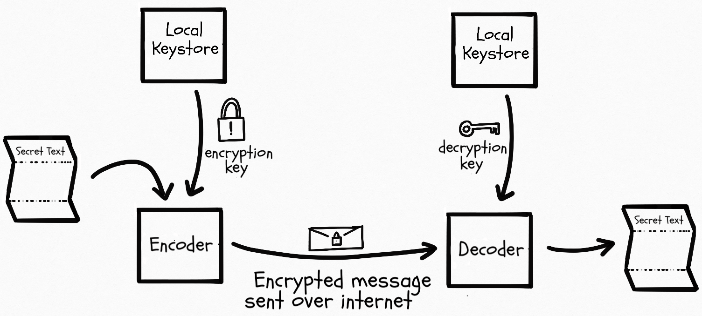
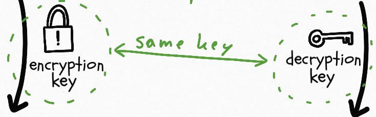
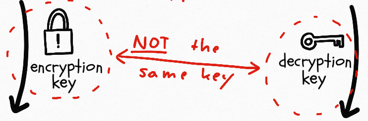

# Elements of Cryptography

Signal is designed with security in mind. As such, some of its architecture depends on fundamental cryptographic concepts, described in this section.

## End to end encryption

**[End-to-end encryption (E2EE)](https://searchsecurity.techtarget.com/definition/end-to-end-encryption-E2EE)** is a method of secure communication that prevents third-parties from accessing data while it’s transferred from one end system or device to another.

In **E2EE**, the data is encrypted on the sender’s system or device and only the recipient is able to decrypt it. Nobody in between, be they an Internet service provider, application service provider or hacker, can read it or tamper with it.

We will illustrate **E2EE** with the following sketch, which is based on the diagram published by [hackernoon](https://hackernoon.com/symmetric-and-asymmetric-encryption-5122f9ec65b1).

Illustration of E2EE. Actions from left to right:

- A user-composed plain message gets encrypted by an encoder. The outcome is a cipher message. The transformation requires the application of an encryption key, which is provided by a local keystore.
- The obtained cipher message is communicated to the recipient, using an insecure communication channel. (The internet)
- The recipient decrypts the cypher message back into plain text. He does so, using a matching decryption key. This key is likewise retrieved from his local key store.

## Types of encryption

We distinguish between two categories of keys. Those have different characteristics and therefor also different applications.

### Symmetric Encryption  

**[Symmetric Encryption](https://www.ibm.com/support/knowledgecenter/en/SSB23S_1.1.0.14/gtps7/s7symm.html)**: A single key is used for encryption and decryption.
  - **Advantage:**
    - A simple underlying mathematical concept allows resource friendly implementations.
  - **Disadvantages:**
    - The key has to be exchanged securely between participants.
    - It creates a single point of failure where if the encryption key of the user is intercepted then all of the future and past messages sent to this user can be read by the adversary.

### Asymmetric Encryption  

[**Asymmetric Encryption**](https://en.wikipedia.org/wiki/Public-key_cryptography): A keypair is used, where one key is used for encryption only (public key) and the other for decryption only (private key).
  - **Advantages:**
    - The key exchange is secure, as the public key does not require any protection.
  - **Disadvantages:**
    - The underlying mathematical concept leads to resource intense implementations.
    - It creates a single point of failure where if the private key of the user is intercepted then all of the future and past messages sent to this user can be read by the adversary.

## Key signature

Public key associated to Bob’s identity has to be used in order to send messages to Bob. Bob’s public key can be signed by another party. It means that Bob’s public key has been verified by a trusted party that it’s in fact belonging to Bob and not to someone else who pretends to be him. Read more on [Wikipedia: Digital Signatures](https://en.wikipedia.org/wiki/Digital_signature) and [Chapter 6: Key Signatures](http://www.pgp.net/pgpnet/pgp-faq/pgp-faq-key-signatures.html).

###  Ephemeral key

> Rather than always encrypting to the same static public key, peers in a
> conversation instead negotiate secrets through an ephemeral key
> exchange. - [Signal](https://signal.org/blog/asynchronous-security/)

## Forward secrecy

> In cryptography, **forward secrecy** (**FS**), also known as **perfect forward secrecy** (**PFS**), is a feature of specific key agreement protocols that gives assurances your session keys will not be compromised even if the private key of the server is compromised. [[1]](https://en.wikipedia.org/wiki/Forward_secrecy#cite_note-Handbook-1) Forward secrecy protects past sessions against future compromises of secret keys or passwords - [Wikipedia](https://en.wikipedia.org/wiki/Forward_secrecy)

## Identity

> The Signal protocol aims to send encrypted messages from one party to another. It assumes each party has a long-term public/private key pair, referred to as the identity key. - [A Formal Security Analysis of the Signal Messaging Protocol](https://eprint.iacr.org/2016/1013.pdf#section.2)

## Cryptographic handshake

Due to the inconveniences of different key types, a cryptographic handshake (where clients settle on keys for a secure communication) typically involves both symmetric and asymmetric keys.

1.  Less-performing **asymmetric encryption** (key-pairs) for an initial key exchange.

2.  Protection-needy **symmetric keys** are exchanged, protected by a initial secure channel, using public keys.

3.  Actual payload is exchanged, encrypted with the symmetric keys.

## Stacked encryption

Secured channels are commonly hardened by applying multiple encryptions in a stacked arrangement. This is to say every message that is sent, is lately protected by multiple keys and implementations. The receiving side then can decrypt the content by applying the decryption keys and implementations in reverse order.

Motivation for this concept is to sidestep _single-points-of-failure_. If an implementation bug is detected in one encryption mechanism, the communication is still protected by the remaining keys. This is why in subsequent diagrams multiple keys show up for _sessions_ as well as for _handshakes_.

## Computational infeasibility

This concept allows securing information by a technically infeasible computational effort. In the context of E2EE, the security lies in the fact that decryption without the appropriate key is possible form a mathematical point of view, but requires more resources than an adversary is assumed to possess.
